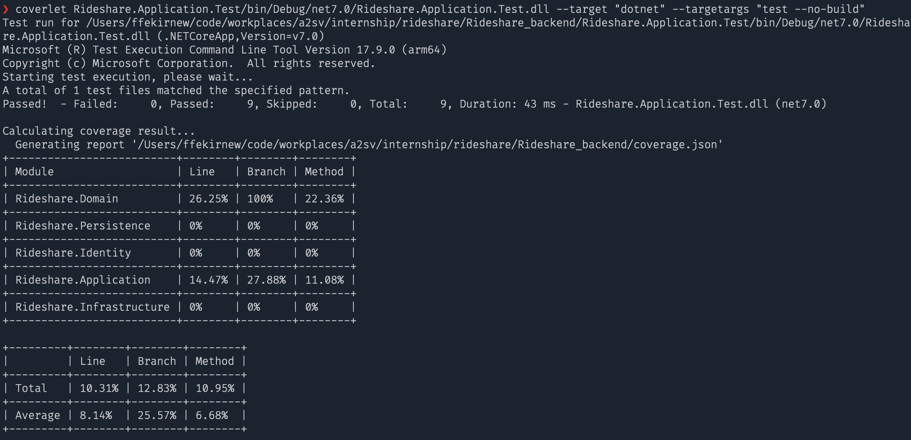
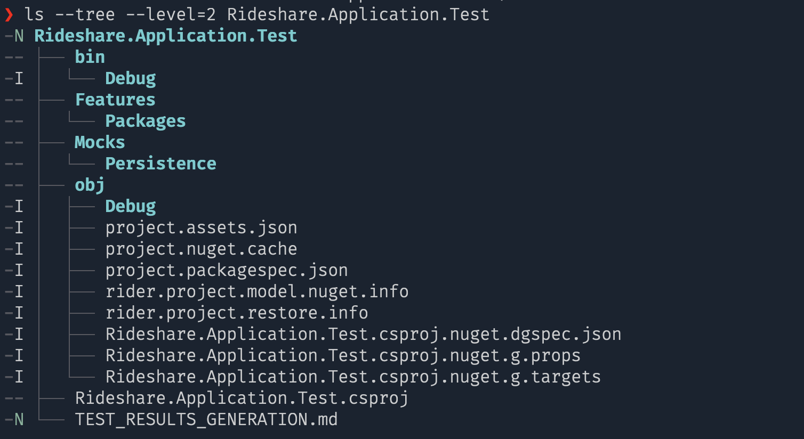
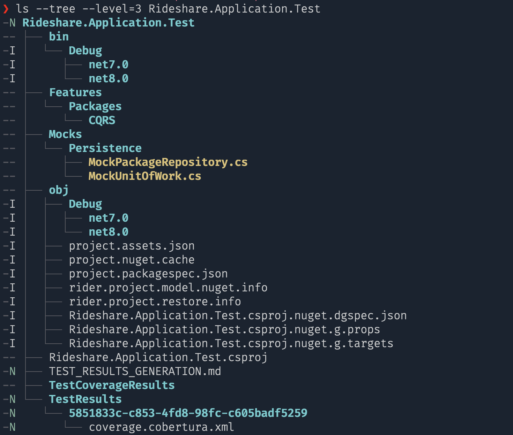
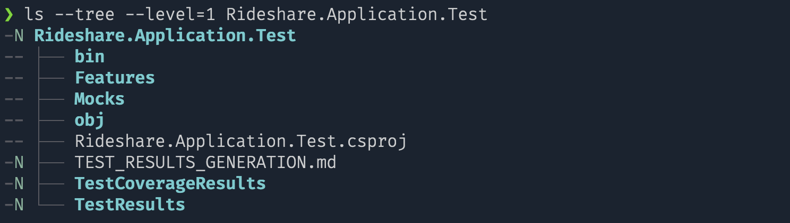
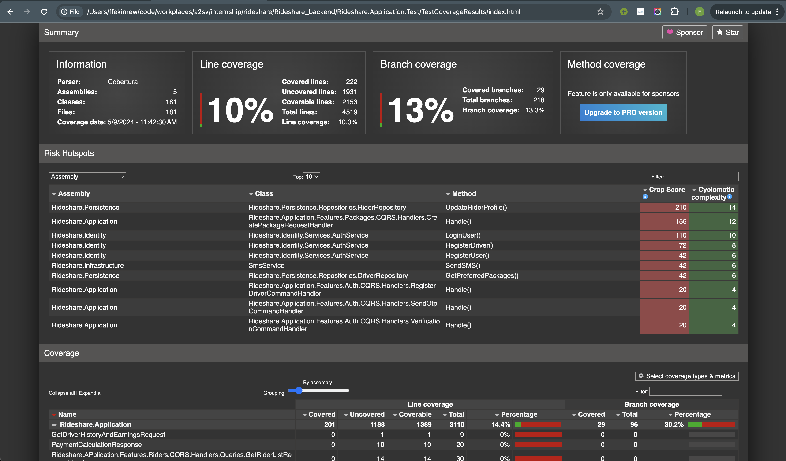

# Test Results Generation

## Table of Contents

1. [Introduction](#introduction)
2. [Options](#options)
   2.1. [Using IDEs](#using-ides)
   2.2. [Using Command Line](#using-command-line)

## 1. Introduction

Test results are statistics generated after running tests on the application. The statistics we are currently looking at is <b>Test Coverage</b>. These statistics are used to determine the quality of the application and to identify any issues that may have arisen during testing. This document outlines the different options available for generating test results.

## 2. Options

There are two ways to generate test results or coverage statistics for the application. The first option is to use an IDE and the second option is to use the command line. The two options will be covered after this.

### 2.1. Using IDEs

IDEs such as JetBrains Rider and Visual Studio have built-in tools that can be used to generate test results. Links to the documentation for generating test results using these IDEs are provided below.

- JetBrains Rider [Test Coverage](https://www.jetbrains.com/help/rider/Unit_Tests_Coverage_window.html)
- Visual Studio [Test Coverage](https://learn.microsoft.com/en-us/visualstudio/test/using-code-coverage-to-determine-how-much-code-is-being-tested?view=vs-2022&tabs=csharp)

But there are advantages and disadvantages to using IDEs.

#### Advantages

- Easy to use (usually, can be done with a click of a button).
- Provides a visual representation of the test coverage.
- If you are already using an IDE, you don't have to install any additional software.

#### Disadvantages

- It will mean that you have to run the tests in the IDE.
- Not as flexible as using the command line.
- May not be as accurate.

which will bring us to the next option.

### 2.2. Using Command Line

The command line is another option for generating test results. This option is more flexible and can be used to generate test results for multiple projects. The command line can be used to generate test results for the application using the `dotnet` command.

There are 2 tools that will be discussed here.

#### 1. Coverlet

Coverlet is a cross-platform code coverage library for .NET Core. It can be used to generate test results for the application. The command to generate test results is shown below.

##### Step 1: Installing Coverlet

```bash
dotnet tool install -g coverlet.console
```

##### Step 2: Generating Test Results

```bash
dotnet build
coverlet Rideshare.Application.Test/bin/Debug/net7.0/Rideshare.Application.Test.dll --target "dotnet" --targetargs "test --no-build"
```

You should get a result like the following image.



This option is good for generating test results easily but it's not as detailed as the next tool.

#### 2. XPlat Code Coverage & ReportGenerator

#### Step 1: Start

Initially, the `Rideshare.Application.Test` folder looks like the following.



#### Step 2: Generating Test Results

Then you can run the following command to run all tests in the solution and generate test results.

```bash
dotnet test --collect:"XPlat Code Coverage"
```

Now the `Rideshare.Application.Test` folder will look like the following.



Notice the new folder `TestResults`.

This command will generate test results and every detail of the test results in the new folder that appeared. The command will also create a new sub-folder in the `TestResults` folder with a random name (possibly generates a GUID for every test) and in that folder you'll find a file called `coverage.cobertura.xml`. Now, this xml file is very unreadable.

So we are going to use another tool called [ReportGenerator](https://danielpalme.github.io/ReportGenerator/) to generate a more readable html file. You can install `ReportGenerator` using the following command.

#### Step 3: Installing ReportGenerator

```bash
dotnet tool install -g dotnet-reportgenerator-globaltool
```

#### Step 4: Generating HTML Report

```bash
reportgenerator -reports:"Rideshare.Application.Test/TestResults/5851833c-c853-4fd8-98fc-c605badf5259/coverage.cobertura.xml" -targetdir:"./Rideshare.Application.Test/TestCoverageResults" -reporttypes:Html
```

Now, another folder will appear in the `Rideshare.Application.Test` folder called `TestCoverageResults`.



And in that folder, you'll find an `index.html` file. You can open this file in your browser to see the test results.



This option is good for generating detailed test results but it's not as easy to use as the previous tool.
